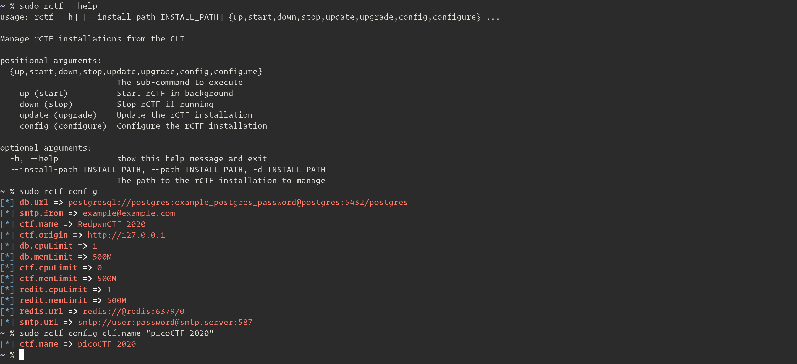

[](https://travis-ci.com/redpwn/rctf)
[](https://codecov.io/github/redpwn/rctf/)

rCTF is RedpwnCTF's CTF platform. It is developed and maintained by the [redpwn](https://redpwn.net) CTF team.

## Design Goals

We have designed rCTF with a focus on these attributes:

* scalability
* simplicity
* customizability

To read more about our motivations for creating this project, see [here](https://github.com/redpwn/rctf/wiki/Purpose-of-rCTF).

## Getting Started

### Installation

#### Automatic

The automatic installation script works on Debian-based distributions and Arch Linux. It depends on `curl`. Feel free to [read the script](https://get.rctf.redpwn.net/) before running this command as root (it's fairly short).

```
# curl https://get.rctf.redpwn.net | sh
```

#### Manual

For manual deployment, clone the repository and run `install/config.sh` as root.

```
$ git clone https://github.com/redpwn/rctf.git
$ cd rctf
# ./install/config.sh
# docker-compose up -d
```

### rCTF CLI Management Tool



The [rCTF CLI management tool](https://github.com/redpwn/rctf-cli) makes management of your rCTF installation simple. It is installed by default through the [automatic installation script](install/install.sh); however, if you have installed rCTF manually, you may install the tool by running:

```
# pip3 install rctf-cli
```

To read more about its usage, see the [wiki page](https://github.com/redpwn/rctf/wiki/Managing-rCTF-through-the-CLI) or the [GitHub repository](https://github.com/redpwn/rctf-cli).

#### Starting rCTF

```
# rctf up
```

#### Stopping rCTF

```
# rctf down
```

#### Upgrading rCTF

```
# rctf update
```

#### Deploying Challenges to rCTF

##### Using rDeploy

If you use [rDeploy](https://github.com/redpwn/rdeploy), you can automatically import the problem data using the below command:

```
# rctf deploy /path/to/challenge/directory/
```

##### Without rDeploy

This is currently not supported, but it will be in the near future.

## Development

We would love your help! Please see [our CONTRIBUTING.md](https://github.com/redpwn/rctf/blob/master/CONTRIBUTING.md).
